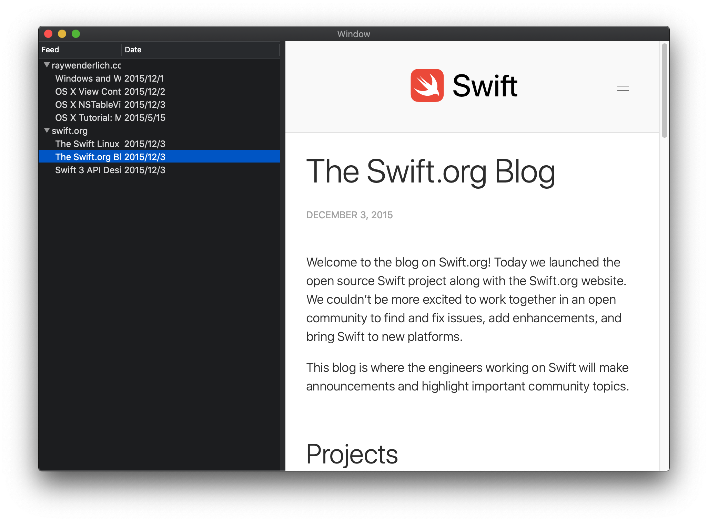

# OutlineViewDemo

- Basic usage of NSOutlineView [Tutorial](https://www.raywenderlich.com/1201-nsoutlineview-on-macos-tutorial)
- Basic usage of WKWebView
- Different way to pass data between `Controllers`
  - [notification center](https://learnappmaking.com/notification-center-how-to-swift/). See `pass_data_use_notification branch`
